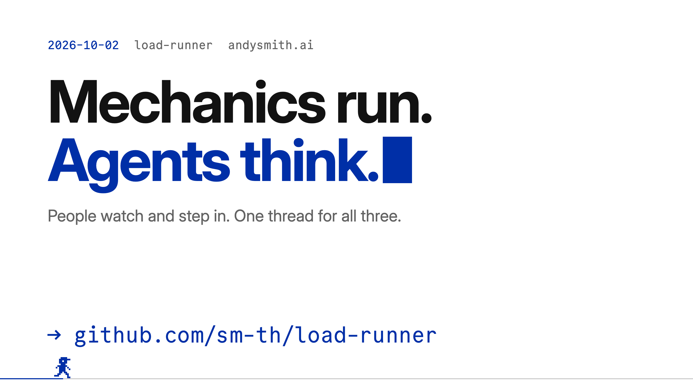
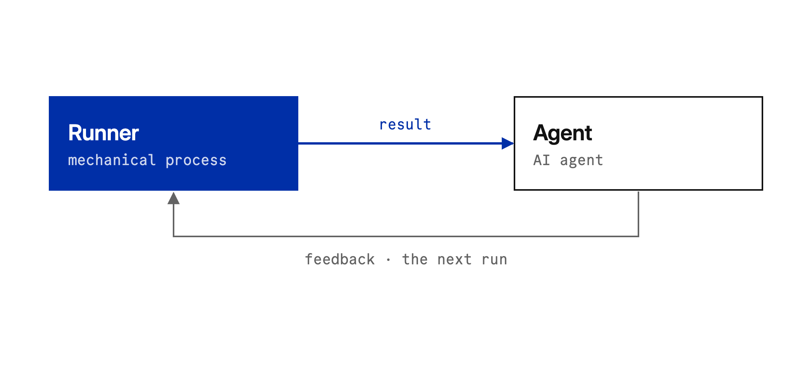
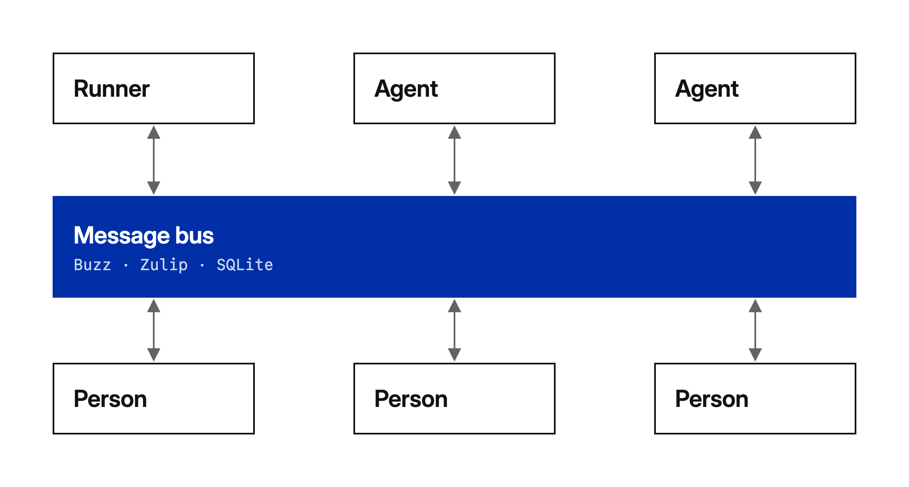
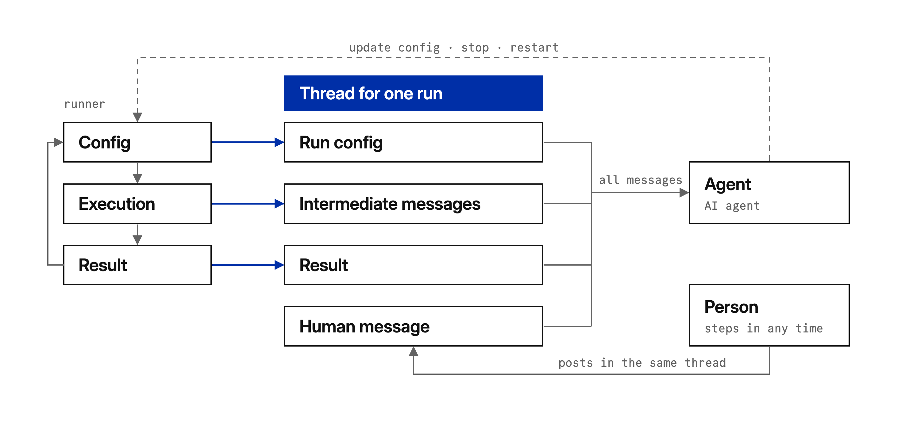
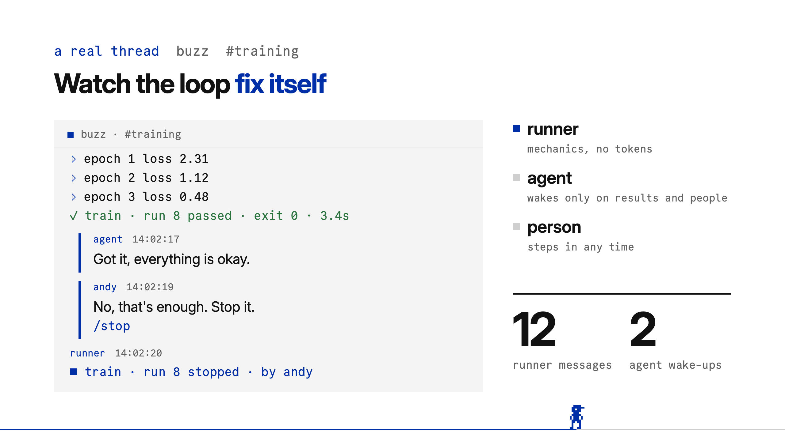

<p align="center">
  <a href="video/load-runner.mp4"></a>
</p>

<p align="center">
  <a href="https://github.com/sm-th/load-runner/actions/workflows/ci.yml"></a>
  
  
  <a href="LICENSE"></a>
</p>

# load-runner

**Mechanical runners, AI agents, and people in one thread.**

Every agent run costs money. A lot of work is not intellectual at all: CI checks, monitoring, a model training in a loop. That is code with parameters that prints progress and a result. load-runner separates the two kinds of work and connects them through a message bus that people already use:

- a **runner** does the mechanical work and opens one thread per run: parameters, output, result;
- an **agent** sleeps until a result or a person needs it, reads the thread, and answers; a `/set` or `/restart` in its answer changes the next run;
- a **person** watches the same thread and steps in at any time: *"No, that's enough. Stop it."*

This is an implementation of [Communication Between Runners and Agents](https://andysmith.ai/2026/Oct/2/communication-between-runners-and-agents/) by Andy Smith. ▶ [Watch the video](video/load-runner.mp4) (74 s, with a chiptune soundtrack).

## The idea in three pictures

**The simplest loop.** The runner reports a result; the agent's feedback affects the next run.

<picture>
  <source media="(prefers-color-scheme: dark)" srcset="docs/assets/diagram-loop-dark.png">
  
</picture>

**One bus for everyone.** Runners, agents, and people share one platform: [Buzz](https://github.com/block/buzz), Zulip, or a local SQLite file. There can be several of each.

<picture>
  <source media="(prefers-color-scheme: dark)" srcset="docs/assets/diagram-bus-dark.png">
  
</picture>

**One thread per run.** The runner posts the run config, intermediate messages, and the result. The agent sees all of it, plus what people write, and can update the config, stop, or restart.

<picture>
  <source media="(prefers-color-scheme: dark)" srcset="docs/assets/diagram-thread-dark.png">
  
</picture>

## Quick start

```sh
git clone https://github.com/sm-th/load-runner && cd load-runner/examples/training
uv run load-runner agent      # terminal 1: the intelligence (a scripted brain, offline)
uv run load-runner run        # terminal 2: the mechanics
uv run load-runner watch      # terminal 3: you
```

The example trains a toy model with a learning rate that is too high. This is the thread it produces, as `load-runner watch` shows it:

```text
01:15:35  train · run 1  runner
    ▶ train · run 1 started
    lr = 0.3
    epochs = 5
    `python3 train.py --lr 0.3 --epochs 5`
01:15:36  train · run 1  runner
    ▹ train · run 1 output
    epoch 1 loss 940
    epoch 2 loss 3.85e+05
    epoch 3 loss nan
01:15:36  train · run 1  runner
    ✗ train · run 1 failed · exit 1 · 1.0s
01:15:36  train · run 1  agent
    Loss diverged to nan at lr = 0.3. Lowering the learning rate.
    /set lr=0.03
    /restart
01:15:37  train · run 1  runner
    ⚙ train · run 1 set · lr = 0.03 for the next run · by agent
01:15:37  train · run 1  runner
    ↻ train · run 1 restarting · by agent
01:15:37  train · run 2  runner
    ▶ train · run 2 started
    lr = 0.03
    …
01:15:39  train · run 2  runner
    ✓ train · run 2 passed · exit 0 · 2.5s
    loss=2.66e-07 w=1.9998
01:15:40  train · run 2  agent
    Got it, everything is okay.
```

Step in from any terminal: `uv run load-runner say "No, that's enough. Stop it."` and `uv run load-runner say /stop`.

To use a real agent, change one line in [`load-runner.toml`](examples/training/load-runner.toml): `command = ["claude", "-p"]` (or `codex exec -`, Hermes, any program that reads a prompt on stdin and prints a reply).

<p align="center"><a href="video/load-runner.mp4"></a></p>

## Commands

| Command | Who | What it does |
|---|---|---|
| `load-runner run` | the runner | loop: read config, open a thread, run the command, post output and result |
| `load-runner agent` | an agent | wake on results and people, pipe the thread to the brain, post its reply |
| `load-runner watch` | a person | follow every thread live |
| `load-runner say TEXT` | a person | post into the latest thread (`--thread ID`, `--as NAME`) |
| `load-runner threads` | anyone | list recent threads |

All take `-c load-runner.toml` (the default).

## The thread protocol

Runner messages start with one header line that people read and code parses:

| Glyph | Event | Example |
|---|---|---|
| `▶` | started | `▶ train · run 7 started` + parameters and the exact command |
| `▹` | output | `▹ train · run 7 output` + a batch of output lines |
| `✓` | passed | `✓ train · run 8 passed · exit 0 · 3.4s` + `::result` lines |
| `✗` | failed | `✗ train · run 7 failed · exit 1 · 3.1s` |
| `■` | stopped | `■ train · run 8 stopped · by andy` |
| `↻` | restarting | `↻ train · run 7 restarting · by agent` |
| `⚙` | set | `⚙ train · run 7 set · lr = 0.03 for the next run · by agent` |
| `⊘` | refused | `⊘ train · run 7 refused · /stop from mallory` |

Anyone else in the thread steers the runner with commands on their own line:

| Command | Effect |
|---|---|
| `/stop` | kill the run (its whole process group) and end the loop |
| `/restart` | kill the run and start the next one now |
| `/set key=value …` | override parameters for the next run; values are TOML (`0.03`, `true`, `"text"`) |
| `/unset key …` | go back to the config value |

The runner listens to the current run's thread and the previous one, so a slow agent's answer to a result still counts. Every command is acknowledged in the thread: the thread is the audit log ([ADR 0001](docs/adr/0001-the-thread-is-the-interface.md)).

A program run by the runner can lift lines into the result message by printing `::result loss=0.12`.

## Configuration

One TOML file; each command reads its own sections. Secrets never go here.

```toml
[bus]
kind = "sqlite"                  # sqlite | buzz | zulip
path = ".load-runner/bus.db"

[runner]
name = "train"                   # threads are "train · run N"; keep it short (Zulip topics hold 60 chars)
command = ["python3", "train.py", "--lr", "{lr}"]   # {param} placeholders; also LOAD_RUNNER_PARAM_<KEY>
interval = 5                     # seconds between runs
runs = 0                         # 0 runs forever
flush = 2                        # seconds between output messages
timeout = 0                      # seconds; 0 never times out
allow = []                       # who may command the runner; empty allows everyone in the thread
wait_for_reply = false           # hold the next run until an agent or a person answers the result
# identity = "runner"            # author name on the SQLite bus
# cwd = "."

[params]
lr = 0.3

[agent]
command = ["claude", "-p"]       # the brain: prompt on stdin, reply on stdout
wake = ["passed", "failed", "chat"]
wake_output = ""                 # regex; also wake on matching output, e.g. "nan|Traceback"
instructions = ""                # appended to the built-in prompt
max_replies = 5                  # per thread
timeout = 300
# identity = "agent"
```

The run's environment also has `LOAD_RUNNER_RUN` and `LOAD_RUNNER_THREAD`. The config is read again before every run, so edits apply to the next one; `/set` overrides win over the file until `/unset`.

## Buses

| Kind | Thread | Setup |
|---|---|---|
| `sqlite` | a row in one local file (WAL); several processes, no server | `path` |
| `buzz` | a [Buzz](https://github.com/block/buzz) channel thread (NIP-10 root), through the [`buzz` CLI](https://github.com/block/buzz/tree/main/crates/buzz-cli) | `channel`; `BUZZ_PRIVATE_KEY`, `BUZZ_RELAY_URL` in the environment, one keypair per participant |
| `zulip` | a topic in a stream | `site`, `stream`; `ZULIP_EMAIL`, `ZULIP_API_KEY` in the environment |
| `memory` | in-process, for tests and embedding | `MemoryHub().connect(name)` |

Every adapter passes the same contract suite (`tests/test_bus_contract.py`). Buzz and Zulip run there against faithful local fakes; neither has been exercised against a live server yet.

Why not Telegram? Telegram bots [cannot see messages from other bots](https://core.telegram.org/bots/faq#why-doesnt-my-bot-see-messages-from-other-bots), so a runner bot and an agent bot could not hear each other.

A new bus is one class with five methods: `start_thread`, `post`, `thread`, `feed`, `threads` ([`bus/__init__.py`](src/load_runner/bus/__init__.py)).

## Embedding

```python
import threading
from pathlib import Path

from load_runner.agent import Agent
from load_runner.bus.memory import MemoryHub
from load_runner.config import load
from load_runner.runner import Runner

path = Path("load-runner.toml")
hub = MemoryHub()
agent = Agent(hub.connect("agent"), load(path).agent, think=lambda prompt, thread: my_model(prompt))
threading.Thread(target=agent.loop, daemon=True).start()
Runner(hub.connect("runner"), lambda: load(path)).loop()
```

## Safety

- Commands change parameters, never the command line. Parameters are substituted into argv elements; no shell is involved.
- `allow` limits who may command the runner; on Buzz and Zulip, channel membership is the first gate.
- The agent never wakes on its own messages, and `max_replies` ends agent-to-agent loops.
- Credentials are read from the environment only and never written to the thread.

## Development

```sh
uv sync
uv run ruff check && uv run ruff format --check && uv run pytest -q
```

See [CONTRIBUTING.md](CONTRIBUTING.md), [AGENTS.md](AGENTS.md), and the glossary in [CONTEXT.md](CONTEXT.md).

The video is rendered from source: [`video/presentation.html`](video/presentation.html) (diagrams in the [Andy Smith design system](https://github.com/sm-th/design)), [`video/music.py`](video/music.py) (an original chiptune in the spirit of *Lode Runner* and the *Road Runner* cartoons, synthesized from scratch), and [`video/render.py`](video/render.py):

```sh
uv run --with numpy --with scipy python video/music.py video/build/music.wav
uv run --with playwright python video/render.py
```

## License

[MIT](LICENSE). Fonts in `video/fonts/`: Inter (OFL 1.1) and Commit Mono (MIT), licenses alongside.
